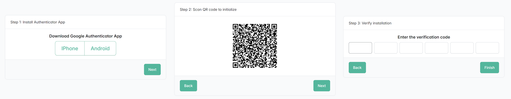
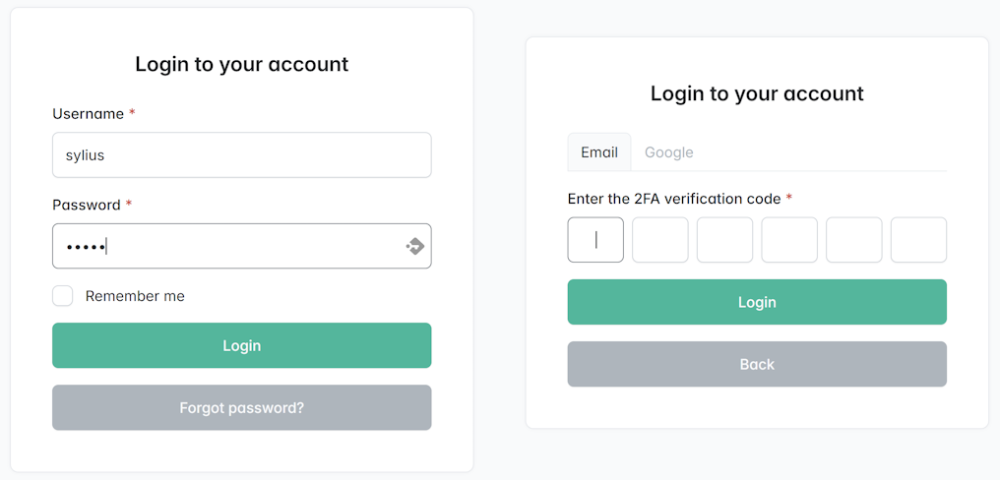

# Sylius 2FA Plugin

[](https://github.com/bitExpert/sylius-2fa/actions)
[](https://packagist.org/packages/bitexpert/sylius-2fa-plugin/)
[](https://rheinneckar.social/@bitexpert)

The **2FA** Plugin for *Sylius* allows admin users and shop users to enable two-factor authentication for their accounts. Users can choose between 2FA via Google Authenticator or email.

### 3-step Setup workflow: 



### 2-step Login workflow:



## Features:
* Admin users and shop users can enable two-factor authentication for their accounts
* Choose between Google Authenticator or email as an authentication method
* During login users can choose which authentication method to use

## Requirements:
* PHP 8.2 or higher
* Sylius 2.0 or higher

## Installation

1. Install the plugin via Composer
```bash
composer require bitexpert/sylius-2fa-plugin
```

2. Enable the plugin
```php
<?php
# config/bundles.php
return [
    // ...

    Scheb\TwoFactorBundle\SchebTwoFactorBundle::class => ['all' => true],
    Endroid\QrCodeBundle\EndroidQrCodeBundle::class => ['all' => true],
    BitExpert\SyliusTwoFactorAuthPlugin\BitExpertSyliusTwoFactorAuthPlugin::class => ['all' => true],
];
```

3. Import config
```yaml
# config/packages/_sylius.yaml
imports:
    # ...

    - { resource: "@BitExpertSyliusTwoFactorAuthPlugin/config/config.yaml" }
    
    # ...
```

4. Import routing
```yaml
# config/routes/bitexpert_sylius_2fa.yaml
bitexpert_sylius_2fa_admin:
  resource: "@BitExpertSyliusTwoFactorAuthPlugin/config/routes/admin.yaml"
  prefix: /%sylius_admin.path_name%

bitexpert_sylius_2fa_shop:
  resource: "@BitExpertSyliusTwoFactorAuthPlugin/config/routes/shop.yaml"
  prefix: /{_locale}
```

5. Update firewall configuration

Add the `two_factor` configuration to your `admin` firewall configuration.
```yaml
# config/packages/security.yaml
security:
  firewalls:
    admin:
      two_factor:
        auth_form_path: bitexpert_sylius_2fa_admin_login
        check_path: bitexpert_sylius_2fa_admin_login_check
        multi_factor: false
```

Add the `two_factor` configuration to your `shop` firewall configuration.
```yaml
# config/packages/security.yaml
security:
  firewalls:
    shop:
      two_factor:
        auth_form_path: bitexpert_sylius_2fa_shop_login
        check_path: bitexpert_sylius_2fa_shop_login_check
        multi_factor: false
```

6. Configure `AdminUser` entity in file `src/Entity/User/AdminUser.php`

Add the `BitExpert\SyliusTwoFactorAuthPlugin\Entity\TwoFactorAuthInterface` interface and the `BitExpert\SyliusTwoFactorAuthPlugin\Entity\TwoFactorAuthTrait` trait to the entity.

```php
<?php

declare(strict_types=1);

namespace App\Entity\User;

use BitExpert\SyliusTwoFactorAuthPlugin\Entity\TwoFactorAuthInterface;
use BitExpert\SyliusTwoFactorAuthPlugin\Entity\TwoFactorAuthTrait;
use Doctrine\ORM\Mapping as ORM;
use Sylius\Component\Core\Model\AdminUser as BaseAdminUser;

#[ORM\Entity]
#[ORM\Table(name: 'sylius_admin_user')]
class AdminUser extends BaseAdminUser implements TwoFactorAuthInterface
{
    use TwoFactorAuthTrait;
}
```

7. Configure `ShopUser` entity in file `src/Entity/User/ShopUser.php`

Add the `BitExpert\SyliusTwoFactorAuthPlugin\Entity\TwoFactorAuthInterface` interface and the `BitExpert\SyliusTwoFactorAuthPlugin\Entity\TwoFactorAuthTrait` trait to the entity.
```php
<?php

declare(strict_types=1);

namespace App\Entity\User;

use BitExpert\SyliusTwoFactorAuthPlugin\Entity\TwoFactorAuthInterface;
use BitExpert\SyliusTwoFactorAuthPlugin\Entity\TwoFactorAuthTrait;
use Doctrine\ORM\Mapping as ORM;
use Sylius\Component\Core\Model\ShopUser as BaseShopUser;

#[ORM\Entity]
#[ORM\Table(name: 'sylius_shop_user')]
class ShopUser extends BaseShopUser implements TwoFactorAuthInterface
{
    use TwoFactorAuthTrait;
}
```

8. Update your database schema
```bash
php bin/console doctrine:migrations:diff
php bin/console doctrine:migrations:migrate
```

## Tests

You can run the unit tests with the following command (requires dependency installation):

    ./vendor/bin/phpunit

## Contribution
Feel free to contribute to this module by reporting issues or create some pull requests for improvements.

To run the Test Application included in the repo, refer to the [Sylius Test Application](https://docs.sylius.com/sylius-plugins/plugins-development-guide/testapplication) docs.
If you are using [DDEV](https://www.ddev.com) you can run the following command to bootstrap the Test Application in Docker:
```bash
ddev start
```

## License
The **Sylius 2FA** Plugin for *Sylius* is released under the MIT license.
